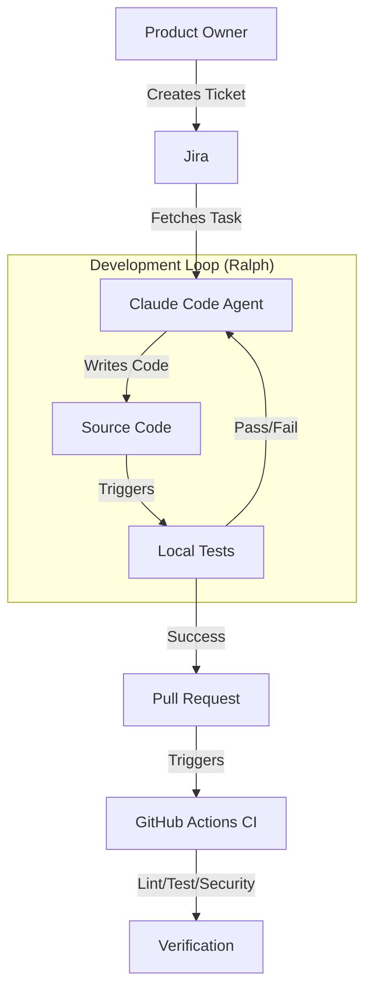

# SEJFA

```
   _____  ______      __  ______   _
  / ____||  ____|    |  ||  ____| / \
 | (___  | |__       |  || |__   / _ \
  \___ \ |  __|  _   |  ||  __| / /_\ \
  ____) || |____| |__| || |    / ____ \
 |_____/ |______|____/ |_|   /_/    \_\
```

**Secure Enterprise Jira Flask Agent**

---

## 📖 About SEJFA

SEJFA is a robust **Subscriber Management System** built with Flask, designed to demonstrate a fully autonomous **Agentic Development Workflow**.

The project serves two key purposes:
1.  **A Functional Application**: A REST API for managing subscribers with admin authentication and reporting.
2.  **An Agentic Framework**: A reference implementation for integrating **Jira**, **Ralph Wiggum Loops**, and **Claude Code** to automate software development tasks.

---

## 🏗 Architecture



---

## ⚡ Features

### 🔌 Application (Subscriber Service)
-   **Admin Authentication**: Secure login with session tokens (`src/grupp_ett/admin_auth.py`).
-   **Subscriber Management**: CRUD operations for email subscribers (`src/grupp_ett/subscriber_service.py`).
-   **Data Export**: CSV export functionality for reporting.
-   **Search**: Efficient subscriber search capabilities.

### 🤖 Agentic Workflow
-   **Jira Integration**: Direct API client to fetch tasks and update statuses (`src/grupp_ett/jira_client.py`).
-   **Ralph Prompts**: Pre-configured prompts for TDD, Bugfixes, and Refactoring (`docs/ralph-prompts.md`).
-   **Memory Management**: Structured `CURRENT_TASK.md` for agent context retention.

### 🛡 Quality Assurance
-   **Automated Testing**: Comprehensive `pytest` suite.
-   **Linting**: Strict code style enforcement with `ruff`.
-   **Security**: Dependency scanning with `safety`.
-   **CI/CD**: GitHub Actions workflows for continuous integration (`.github/workflows/ci.yml`).

---

## 🚀 Getting Started

### Prerequisites
-   Python 3.10+
-   `pip`
-   Jira Account (for agentic features)

### Installation

1.  **Clone the repository:**
    ```bash
    git clone https://github.com/your-org/sejfa.git
    cd sejfa
    ```

2.  **Create a virtual environment:**
    ```bash
    python -m venv venv
    source venv/bin/activate  # On Windows: venv\Scripts\activate
    ```

3.  **Install dependencies:**
    ```bash
    pip install -r requirements.txt
    ```

### Running the Application

Start the Flask development server:
```bash
python app.py
```
The API will be available at `http://localhost:5000`.

### Running Tests

Execute the test suite to verify the installation:
```bash
pytest -v
```

---

## 🤖 Agentic Development Guide

To use the autonomous development features, refer to the **Ralph Prompts** in `docs/ralph-prompts.md`.

### Basic Loop
1.  Pick a task from Jira.
2.  Initialize `CURRENT_TASK.md` with ticket details.
3.  Run the Ralph Loop:
    ```bash
    claude -p "Your Ralph Prompt here..."
    ```

---

## 📂 Project Structure

```
.
├── app.py                  # Flask Application Entry Point
├── CURRENT_TASK.md         # Agent Context Memory
├── docs/                   # Documentation & Prompts
│   └── ralph-prompts.md    # Ralph Loop Templates
├── src/                    # Source Code
│   └── grupp_ett/          # Main Package
│       ├── admin_auth.py   # Auth Service
│       ├── jira_client.py  # Jira API Client
│       └── subscriber_service.py # Business Logic
└── tests/                  # Test Suite
```

---
