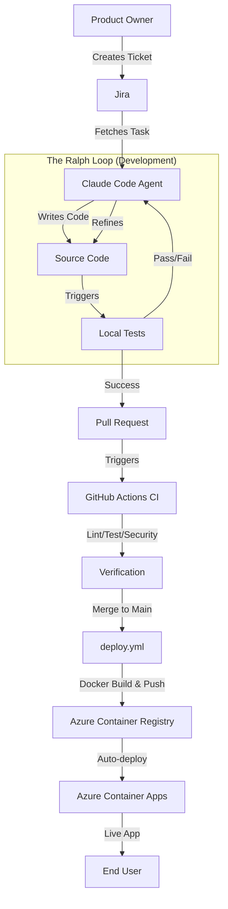

# SEJFA - Secure Enterprise Jira Flask Agent


[](https://www.python.org/)
[](https://flask.palletsprojects.com/)
[](https://azure.microsoft.com/)
[](https://www.atlassian.com/software/jira)
[](https://github.com/your-org/sejfa)
[](LICENSE)

> **"From Jira Ticket to Production — Untouched by Human Hands."**

---

## 📖 About SEJFA

SEJFA is a cutting-edge **Agentic DevOps Loop System**, meticulously crafted by **Filippa, Simon, Jonas Ö, Emma, and Annika**. This project is a living demonstration of the future of software development: a fully autonomous workflow where AI Agents (powered by **Claude Code** and **Ralph Wiggum Loops**) take ownership of the entire lifecycle—from picking up a Jira ticket to deploying a production-ready application on Azure.

### 🌟 Ideally Suited For:
- **Autonomous Development:** Exploring the limits of AI-driven coding.
- **Enterprise Integration:** Seamlessly connecting Jira, GitHub, and Azure.
- **Real-Time Monitoring:** Visualizing the agent's thought process and actions.

---

## 🎨 Chaos vs Clarity


Development can be chaotic. SEJFA brings order through **The Ralph Loop**—a structured, test-driven development cycle that ensures quality at every step. By enforcing strict gates (linting, testing, security scanning) before a task is even considered "complete," SEJFA transforms the unpredictable nature of coding into a streamlined, predictable pipeline.

---

## ⚡ Key Features

| Feature | Description |
| :--- | :--- |
| **🤖 Agentic Workflow** | Autonomous task execution with `start-task` and `finish-task` commands, powered by Claude Code. |
| **🔄 Ralph Loop** | A rigorous TDD cycle: Red -> Green -> Refactor -> Verify. Quality is non-negotiable. |
| **🔌 Jira Integration** | Direct two-way sync with Jira. Tickets are fetched, updated, and closed automatically. |
| **☁️ Azure Deployment** | Zero-downtime deployments to **Azure Container Apps** via GitHub Actions. |
| **📊 Real-Time Monitor** | Watch the agents work in real-time on the [Monitoring Dashboard](https://gruppett.fredlingautomation.dev/static/monitor.html). |
| **🛡️ Secure & Scalable** | Built on Flask with Gunicorn, Dockerized for portability, and secured with `safety` scans. |

---

## 🏗 Architecture

The SEJFA architecture is designed for resilience and autonomy. The **Claude Code Agent** operates within the **Ralph Loop**, interacting with the codebase, running tests, and managing git operations, all while communicating with **Jira** and **Azure**.



---

## 🚀 Getting Started

Follow these steps to set up your own Agentic DevOps environment.

### Prerequisites

-   **Python 3.10+**
-   **Docker** (for local container testing)
-   **Jira Account** (API token required for agent integration)
-   **Azure Account** (for deployment)

### Installation

1.  **Clone the Repository**
    ```bash
    git clone https://github.com/your-org/sejfa.git
    cd sejfa
    ```

2.  **Set Up Virtual Environment**
    ```bash
    python -m venv venv
    source venv/bin/activate  # Windows: venv\Scripts\activate
    ```

3.  **Install Dependencies**
    ```bash
    pip install -r requirements.txt
    ```

4.  **Configure Environment**
    Create a `.env` file based on `.env.example` (if available) with your Jira and Azure credentials.

### Running the Application

Start the Flask development server:
```bash
python app.py
```
Access the application at `http://localhost:5000`.

### Running Tests

Verify the system integrity with `pytest`:
```bash
pytest -v
```

---

## 🤖 Agentic Development Guide

Unlock the power of autonomous coding with the **Ralph Skills** in `.claude/skills`.

### 1. Start a Task
Initialize a new task from a Jira ticket. This sets up the branch and context.
```bash
claude -i start-task <JIRA-ID>
```

### 2. The Ralph Loop
The agent enters the loop:
- **Red:** Write a failing test.
- **Green:** Implement the solution.
- **Refactor:** Optimize code.
- **Verify:** Run linting and security checks.

### 3. Finish Task
Once the loop is complete and all checks pass:
```bash
claude -i finish-task
```
This pushes the changes, creates a PR, and updates the Jira ticket.

---

## 📚 Documentation

-   **[DEPLOYMENT.md](docs/DEPLOYMENT.md)** - Detailed guide for deploying to Azure Container Apps.
-   **[Jules Playbook](docs/jules-playbook.md)** - Insights into the AI review system.
-   **[Context Memory](CURRENT_TASK.md)** - The agent's current working memory.

---

## 📂 Project Structure

```
.
├── .claude/                # Agent Configuration & Skills
│   ├── hooks/              # Git/Loop Hooks (stop-hook)
│   └── skills/             # Agent Skills (start-task, finish-task)
├── agent/                  # Agent Prompts & Plans
├── app.py                  # Flask Application Entry Point
├── CURRENT_TASK.md         # Agent Context Memory
├── src/                    # Source Code
│   └── sejfa/              # Main Package
│       ├── core/           # Business Logic
│       ├── integrations/   # External Integrations (Jira)
│       └── monitor/        # Real-time Monitoring
└── tests/                  # Test Suite
```

---

## 🤝 Contributing

We welcome contributions! Please follow the **Ralph Loop** methodology:
1.  Fork the repository.
2.  Create a feature branch (`feature/issue-description`).
3.  Ensure all tests pass.
4.  Submit a Pull Request.

---

## 📄 License

This project is licensed under the MIT License - see the [LICENSE](LICENSE) file for details.

---

*Built with ❤️ by the SEJFA Team.*
