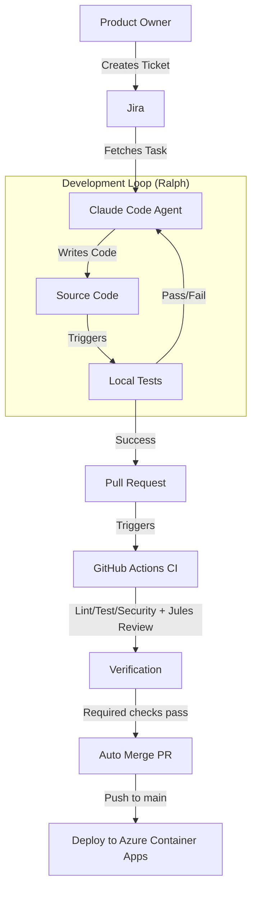

# SEJFA

```
   _____  ______      __  ______    _
  / ____||  ____|    |  ||  ____|  / \
 | (___  | |__       |  || |__    / _ \
  \___ \ |  __|  _   |  ||  __|  / /_\ \
  ____) || |____| |__|  || |    / ____  \
 |_____/ |______|______/ |_|   /_/    \__\
```

**Secure Enterprise Jira Flask Agent**

---

## 📖 About SEJFA

SEJFA is a robust **Subscriber Management System** built with Flask, designed to demonstrate a fully autonomous **Agentic Development Workflow**.

The project serves two key purposes:
1.  **A Functional Application**: A REST API for managing subscribers with admin authentication and reporting.
2.  **An Agentic Framework**: A reference implementation for integrating **Jira**, **Ralph Wiggum Loops**, and **Claude Code** to automate software development tasks.

---

## 🏗 Architecture



---

## ⚡ Features

### 🔌 Application (Subscriber Service)
-   **Admin Authentication**: Secure login with session tokens (`src/sejfa/core/admin_auth.py`).
-   **Subscriber Management**: CRUD operations for email subscribers (`src/sejfa/core/subscriber_service.py`).
-   **Data Export**: CSV export functionality for reporting.
-   **Search**: Efficient subscriber search capabilities.

### 🤖 Agentic Workflow
-   **Jira Integration**: Direct API client to fetch tasks and update statuses (`src/sejfa/integrations/jira_client.py`).
-   **Ralph Skills**: Specialized skills in `.claude/skills` for starting and finishing tasks (`start-task`, `finish-task`).
-   **Ralph Loop Enforcement**: A strict stop-hook (`.claude/hooks/stop-hook.py`) that prevents task completion until all quality gates pass (tests, linting, formatting).
-   **Memory Management**: Structured `CURRENT_TASK.md` for agent context retention.

### 🛡 Quality Assurance
-   **Automated Testing**: Comprehensive `pytest` suite.
-   **Linting**: Strict code style enforcement with `ruff check`.
-   **Formatting**: Automated code formatting with `ruff format`.
-   **Security**: Dependency scanning with `safety`.
-   **CI/CD**: GitHub Actions workflows for continuous integration (`.github/workflows/ci.yml`).

---

## 🚀 Getting Started

### Prerequisites
-   Python 3.10+
-   `pip`
-   Jira Account (for agentic features)

### Installation

1.  **Clone the repository:**
    ```bash
    git clone https://github.com/your-org/sejfa.git
    cd sejfa
    ```

2.  **Create a virtual environment:**
    ```bash
    python -m venv venv
    source venv/bin/activate  # On Windows: venv\Scripts\activate
    ```

3.  **Install dependencies:**
    ```bash
    pip install -r requirements.txt
    ```

### Running the Application

Start the Flask development server:
```bash
python app.py
```
The API will be available at `http://localhost:5000`.

### Running Tests

Execute the test suite to verify the installation:
```bash
pytest -v
```

---

## 🤖 Agentic Development Guide

To use the autonomous development features, use the **Ralph Skills** located in `.claude/skills`.

### Basic Workflow
1.  **Start a Task**:
    ```bash
    claude -i start-task <JIRA-ID>
    ```
    This initializes `CURRENT_TASK.md` and creates the branch.

2.  **Run the Loop**:
    The agent will work autonomously. The stop-hook will enforce quality gates.

3.  **Finish Task**:
    ```bash
    claude -i finish-task
    ```
    This runs verification, commits, pushes, creates PR, labels it for guarded
    auto-merge, and updates Jira.

4.  **Automatic merge + deploy**:
    After CI + Jules checks pass, PR merges automatically to `main`, which
    triggers deployment to Azure Container Apps.

---

## 📂 Project Structure

```
.
├── .claude/                # Agent Configuration & Skills
│   ├── hooks/              # Git/Loop Hooks (stop-hook)
│   └── skills/             # Agent Skills (start-task, finish-task)
├── app.py                  # Flask Application Entry Point
├── CURRENT_TASK.md         # Agent Context Memory
├── agent/                  # Agent Prompts & Plans
│   └── ralph-prompts.md    # Ralph Loop Templates (Legacy)
├── src/                    # Source Code
│   └── sejfa/              # Main Package
│       ├── core/           # Business Logic
│       ├── integrations/   # External Integrations (Jira)
│       └── utils/          # Utilities
└── tests/                  # Test Suite
```

---
