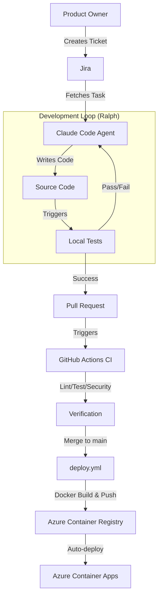

# SEJFA

```
   _____  ______      __  ______    _
  / ____||  ____|    |  ||  ____|  / \
 | (___  | |__       |  || |__    / _ \
  \___ \ |  __|  _   |  ||  __|  / /_\ \
  ____) || |____| |__|  || |    / ____  \
 |_____/ |______|______/ |_|   /_/    \__\
```

**Secure Enterprise Jira Flask Agent**

---

## 📖 About SEJFA

SEJFA is a robust **Agentic Devops Loop System** ,created by Filippa, Simon, Jonas Ö, Emma and Annika. The system is designed to demonstrate a fully autonomous AI-workflow where coding AI Agents deliver full scale developed products, from taking a Jira-ticket to a deliverable poroduct delpoyed on Azure

### Check Out Our Beautiful Visual Agentic DevOps Monotior Below!
https://gruppett.fredlingautomation.dev/static/monitor.html

## The project serves two key purposes:
1.  **A Functional Application**: A Flask web app (SEJFA — Secure Enterprise Jira Flask Agent) with admin panels, expense tracking, subscriber management, and a real-time monitoring dashboard — deployed as a Docker container on **Azure Container Apps**.
2.  **An Agentic Framework**: A reference implementation for integrating **Jira**, **Ralph Wiggum Loops**, and **Claude Code** to automate software development tasks end-to-end — from Jira ticket to production deploy.

---

## 🏗 Architecture



---

## ⚡ Features

### 🔌 Application Endpoints
The Flask app exposes the following routes:

| Route | Description |
|-------|-------------|
| `/` | Hello endpoint (landing page) |
| `/health` | Health check (used by Docker and Azure for readiness probes) |
| `/admin/*` | Admin panel — authentication, subscriber management, statistics, CSV export |
| `/expenses/*` | Expense tracker |
| `/monitor/*` | Real-time dashboard for the Ralph Loop (powered by SocketIO) |

The app runs via **gunicorn** on port 5000 inside a Docker container.

### 🤖 Agentic Workflow
-   **Jira Integration**: Direct API client to fetch tasks and update statuses (`src/sejfa/integrations/jira_client.py`).
-   **Ralph Skills**: Specialized skills in `.claude/skills` for starting and finishing tasks (`start-task`, `finish-task`).
-   **Ralph Loop Enforcement**: A strict stop-hook (`.claude/hooks/stop-hook.py`) that prevents task completion until all quality gates pass (tests, linting, formatting).
-   **Memory Management**: Structured `CURRENT_TASK.md` for agent context retention.

### 🛡 Quality Assurance
-   **Automated Testing**: Comprehensive `pytest` suite.
-   **Linting**: Strict code style enforcement with `ruff check`.
-   **Formatting**: Automated code formatting with `ruff format`.
-   **Security**: Dependency scanning with `safety`.
-   **CI/CD**: GitHub Actions workflows for continuous integration (`.github/workflows/ci.yml`) and continuous deployment (`.github/workflows/deploy.yml`).

---

## 🔄 End-to-End Pipeline

The full journey from idea to production looks like this:

```
1. Jira ticket (GE-xxx)
        │
        ▼
2. /start-task GE-xxx
   → Claude Code fetches ticket via Jira REST API
   → Creates branch: feature/GE-xxx-slug
   → Populates docs/CURRENT_TASK.md
        │
        ▼
3. Ralph Loop (TDD)
   → Red: writes a failing test
   → Green: minimal implementation
   → Refactor
   → Updates CURRENT_TASK.md
   → Commit: "GE-xxx: description"
   → Repeats until all acceptance criteria ✓
        │
        ▼
4. /finish-task
   → Pushes branch → Creates PR
   → CI runs (lint, test on Python 3.10–3.13, security scan)
   → Jules performs AI code review
        │
        ▼
5. Merge to main
        │
        ▼
6. deploy.yml triggers automatically
   → Docker build → Push to ACR → Deploy to Azure Container Apps
        │
        ▼
7. App is live on Azure
```

### What Happens After Deploy

Every time a PR is merged to `main`:
- `deploy.yml` builds a new Docker image tagged with the commit SHA + `latest`.
- The image is pushed to **Azure Container Registry (ACR)**.
- **Azure Container Apps** automatically rolls out the new revision with zero-downtime deployment.

This means the app is continuously deployed — it is not rebuilt from scratch each time. Every merge delivers an incremental update to the same running application.

### Viewing the Live App

To find the application URL:
1. **Azure Portal** → Container Apps → your app → Overview → *Application Url*
2. Or via CLI:
   ```bash
   az containerapp show \
     --name <APP_NAME> \
     --resource-group <RESOURCE_GROUP> \
     --query properties.configuration.ingress.fqdn
   ```

---

## 🚀 Getting Started

### Prerequisites
-   Python 3.10+
-   `pip`
-   Jira Account (for agentic features)

### Installation

1.  **Clone the repository:**
    ```bash
    git clone https://github.com/your-org/sejfa.git
    cd sejfa
    ```

2.  **Create a virtual environment:**
    ```bash
    python -m venv venv
    source venv/bin/activate  # On Windows: venv\Scripts\activate
    ```

3.  **Install dependencies:**
    ```bash
    pip install -r requirements.txt
    ```

### Running the Application

Start the Flask development server:
```bash
python app.py
```
The API will be available at `http://localhost:5000`.

### Running Tests

Execute the test suite to verify the installation:
```bash
pytest -v
```

---

## 🤖 Agentic Development Guide

To use the autonomous development features, use the **Ralph Skills** located in `.claude/skills`.

### Basic Workflow
1.  **Start a Task**:
    ```bash
    claude -i start-task <JIRA-ID>
    ```
    This initializes `CURRENT_TASK.md` and creates the branch.

2.  **Run the Loop**:
    The agent will work autonomously. The stop-hook will enforce quality gates.

3.  **Finish Task**:
    ```bash
    claude -i finish-task
    ```
    This runs verification, commits, pushes, and updates Jira.

---

## 📚 Documentation

- **[DEPLOYMENT.md](docs/DEPLOYMENT.md)** - Production deployment guide (Cloudflare Tunnel setup, troubleshooting Error 1033)
- **[jules-playbook.md](docs/jules-playbook.md)** - Jules AI review system guide
- **[CURRENT_TASK.md](docs/CURRENT_TASK.md)** - Active task context (agent memory)

---

## 📂 Project Structure

```
.
├── .claude/                # Agent Configuration & Skills
│   ├── hooks/              # Git/Loop Hooks (stop-hook)
│   └── skills/             # Agent Skills (start-task, finish-task)
├── app.py                  # Flask Application Entry Point
├── CURRENT_TASK.md         # Agent Context Memory
├── agent/                  # Agent Prompts & Plans
│   └── ralph-prompts.md    # Ralph Loop Templates (Legacy)
├── src/                    # Source Code
│   └── sejfa/              # Main Package
│       ├── core/           # Business Logic
│       ├── integrations/   # External Integrations (Jira)
│       └── utils/          # Utilities
└── tests/                  # Test Suite
```

---
